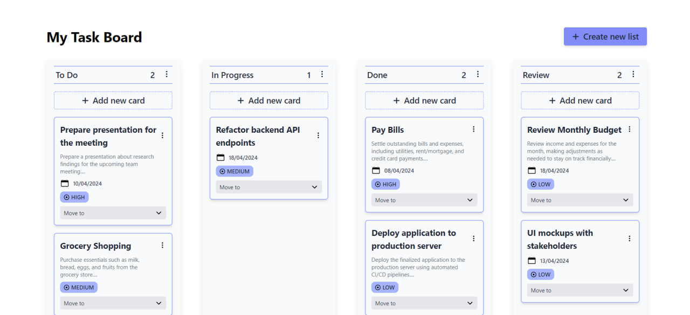
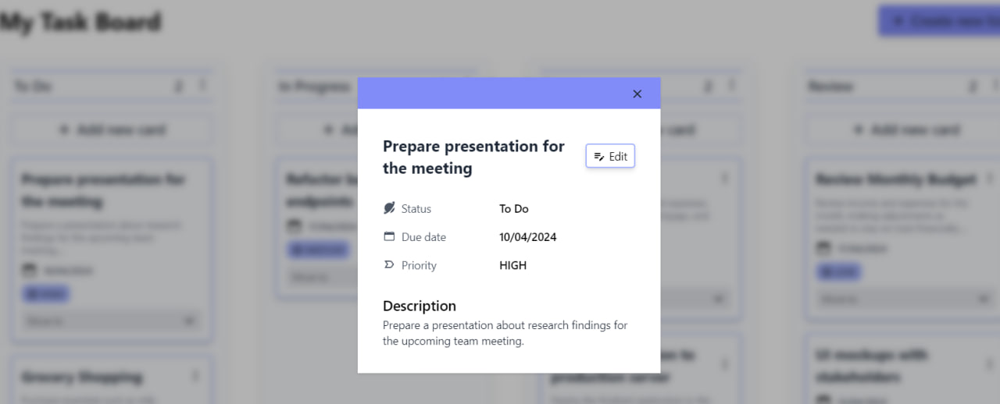

# Task Board App
This is a task board application designed to streamline project management and task organization.

## Technologies Used

### Frontend
+ **Vite**: Vite was utilized to set up the project, offering rapid development and a modern build toolchain.
+ **React + TypeScript**: The frontend is developed using React framework with TypeScript, ensuring type safety and robustness.
+ **Redux**: Redux is employed for efficient state management, providing a centralized store for application data.
+ **Tailwind CSS:**: Tailwind CSS is employed for styling, allowing for rapid UI development with its utility-first approach and customizable design system.
+ **Axios**: Axios is utilized for making HTTP requests, providing a simple and elegant API for handling asynchronous data fetching.
+ **React Router Dom**: React Router Dom is used for declarative routing in the application, enabling seamless navigation between different views and enhancing user experience.
+ **React Hook Form**: React Hook Form offers a lightweight and flexible form validation solution, ensuring robust form handling with minimal boilerplate code.
+ **Zod**: Zod is employed for data validation, offering a simple and intuitive schema-based approach to ensure data integrity and reliability.
+ **React Toastify**: Notifications are managed using React Toastify for a clean and customizable notification system.

### Backend
+ **NestJS**: The backend is built with NestJS, a progressive Node.js framework, providing a solid architectural foundation and efficient development experience.
+ **TypeScript**: TypeScript is utilized throughout the backend codebase, enabling static typing and enhanced tooling for improved developer productivity and code quality.
+ **PostgreSQL**: PostgreSQL is chosen as the database management system, offering robust features, reliability, and scalability for storing and managing task-related data.
+ **TypeORM**: TypeORM is integrated for seamless interaction with the PostgreSQL database, providing a convenient Object-Relational Mapping (ORM) solution for database operations.


## Installation
 Clone the repository: ```git clone https://github.com/sandrvvu/task-board.git```

Install dependencies
 
Run the frontend part: 
```
cd frontend
npm run dev
```

Run the development server: 
```
cd backend
npm run start:dev
```

### Note 
You should create config.ts file in the project backend/src folder:
```
export const USERNAME = '';
export const PASSWORD = '';
export const DATABASE = '';
```

Replace empty strings with your database info.

## Screenshots
+ Board

+ Create List

+ Create Task

+ Show Task



# Happy coding and stay productive!ꨄꨄꨄ
